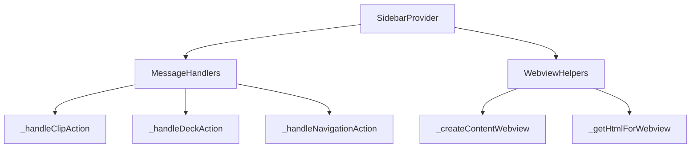
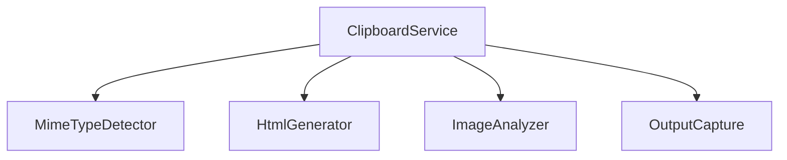
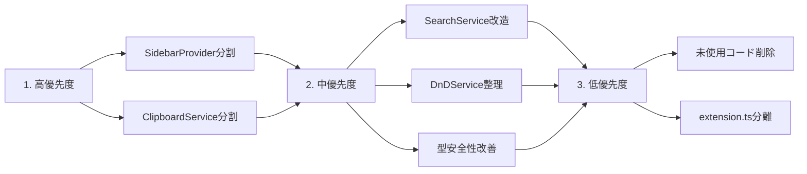

# DataDeck リファクタリング計画書

## 概要
2度のリファクタリング後のコードレビューに基づき、追加でリファクタリングが必要な箇所を整理する。

---

## 1. リファクタリング優先度: 高

### 1.1 SidebarProvider の巨大化
**ファイル**: [`src/sidebar/sidebarProvider.ts`](src/sidebar/sidebarProvider.ts)
**問題**: 523行と非常に長いクラス

| 箇所 | 問題 | 推奨アクション |
|------|------|---------------|
| `_sendDeck` / `_sendFilteredDeck` | 類似したロジックが重複 | 共通基底メソッド `_sendDeckInternal` を作成 |
| message handler (switch文) | 100行以上の長いswitch | `_handleMessage` を `_handleClipAction`, `_handleDeckAction` 等に分割 |
| `_openImageInNewWindow` / `_openHtmlClip` / `_openTextClip` | Webview生成ロジックが重複 | `_createContentWebview` 等の共通メソッドに抽出 |



### 1.2 ClipboardService の単一責任の原則違反
**ファイル**: [`src/clipboard/clipboardService.ts`](src/clipboard/clipboardService.ts)
**問題**: 323行、Multiple responsibilities

| 箇所 | 問題 | 推奨アクション |
|------|------|---------------|
| `captureOutput` (100行超) | 出力キャプチャ・ MIME判定・クリップ生成全てを担当 | メソッドを分割 |
| `getMimePriority` | MIME優先度判定ロジック | `MimeTypeDetector` クラスに分離 |
| `dataResourceToHtml` | HTML生成ロジック | `HtmlGenerator` クラスに分離 |
| `getImageDimensions` | 画像解析ロジック | `ImageAnalyzer` クラスに分離 |



---

## 2. リファクタリング優先度: 中

### 2.1 SearchService の静的メソッド問題
**ファイル**: [`src/search/searchService.ts`](src/search/searchService.ts)
**問題**: 全て静的メソッドで依存注入不可

| 推奨アクション | 理由 |
|---------------|------|
| インスタンスメソッドに変更 | テスト容易性・拡張性の向上 |
| `SearchFilters` 適用ロジックを別クラスに分離 | フィルタリングルールの追加・変更が容易になる |

### 2.2 DnDService の空メソッド
**ファイル**: [`src/sidebar/components/dndService.ts`](src/sidebar/components/dndService.ts:48)
**問題**: `saveDeck` は StorageService の単なるラップ

```typescript
// 現在のコード
static async saveDeck(deck: Deck, storageService: StorageService): Promise<void> {
  deck.lastUpdated = Date.now();
  await storageService.saveDeck(deck);
}
```

**推奨アクション**: このメソッドを削除し、`StorageService.saveDeck` を直接使用

### 2.3 MarimoAdapter の型安全性
**ファイル**: [`src/notebook/marimoAdapter.ts`](src/notebook/marimoAdapter.ts:56)
**問題**: `createMockCell` で `as any` が複数使用

**推奨アクション**: 
- 適切なインターフェースを定義して `as any` を排除
- または `INotebookAdapter` の設計を見直し

### 2.4 NotebookAdapter の型安全性
**ファイル**: [`src/notebook/notebookAdapter.ts`](src/notebook/notebookAdapter.ts:49)
**問題**: `as any` cast が使用されている

**推奨アクション**: vscode API の型を適切に利用

---

## 3. リファクタリング優先度: 低

### 3.1 未使用コードの削除
**ファイル**: [`src/utils/htmlEscape.ts`](src/utils/htmlEscape.ts:25)
**問題**: `unescapeHtml` メソッドがどこからも使用されていない

**推奨アクション**: 
- 使用箇所を確認後、未使用なら削除
- または JSDoc で `@deprecated` としてマーク

### 3.2 Types の冗長定義
**ファイル**: [`src/types/index.ts`](src/types/index.ts:64)
**問題**: `NotebookCell`, `NotebookCellOutput`, `NotebookCellOutputItem` が vscode API の型と重複

**推奨アクション**: 
- 可能であれば vscode の型を import して使用
- 独自定義が必要な場合のみ維持

### 3.3 extension.ts のSeparation of Concerns
**ファイル**: [`src/extension.ts`](src/extension.ts:65)
**問題**: `checkGitignoreRecommendation` が activate 関数内に混在

**推奨アクション**: `GitignoreService` 等の専用クラスに分離

---

## 4. 技術的負債

### 4.1 エラー処理の統一性
- 各サービスでエラー処理の粒度が異なる
- 統一されたエラー型またはエラー_HANDLER の導入を検討

### 4.2 ロギングの統一性
- `console.log` / `console.error` が散在
- 統一されたロギングサービスの導入を検討

### 4.3 設定値のハードコード
- 例: `imageQuality: 85` ([`storageService.ts:47`](src/storage/storageService.ts:47))
- 設定クラスへの集約を検討

---

## 5. 推奨リファクタリング順序



---

## 6. 実施時の注意事項

1. **テストの存在**: リファクタリング前にテストカバレッジを確認
2. **段階的実施**: 大きな変更は複数PRに分割
3. **後方互換性**: 公開APIを変更する場合はバージョンアップを検討
4. **ドキュメント更新**: リファクタリング後はREADMEや設計資料を更新